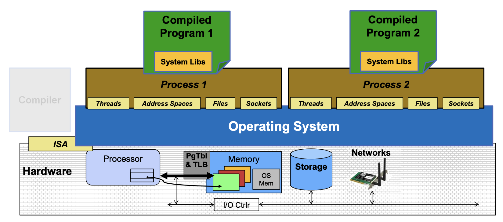

# What is an Operating System

**OS Basics: Virtualizing the Machine**

- OS translates from hardware interface to application interface
- OS provides each running program with its own process

A process consists of:
- Address Space
- One or more threads of control executing in that address space
- Additional system state associated with it
    - Open files
    - Open sockets (network connections) 
    - ...