# CSAPP


## Bits, Bytes and Ints


## Floating Point


## Machine Program
### Basics

```
movq Source,Dest
```
Operand Types: Immediate, Register, Memory

Memory Addressing Modes:
```
D(Rb,Ri,S)  Mem[Reg[Rb]+S*Reg[Ri]+D]
D:Constant“displacement” 1, 2 or 4 bytes	  
Rb: Base register: Any of 16 integer registers	  
Ri: Index register: Any, except for %rsp
S: Scale: 1, 2, 4 or 8
```

Two	Operand	Instructions:
```
leaq Src,Dst
addq, subq, imulq, salq, sarq, shrq, xorq, andq, orq
```

One	Operand Instruc�ons:
```
incq Dest   Dest = Dest + 1
decq Dest   Dest = Dest ­‐ 1
negq Dest   Dest = -­Dest
notq Dest   Dest = ~Dest
```

### Control
Condition codes
```
cmpq Src2,Src1
testq Src2,Src1
```
Sigle bit registers:
- CF Carry Flag (for unsigned) 
- SF Sign Flag (for signed)	  
- ZF Zero Flag 
- OF Overflow Flag (for signed)
Conditional branches
```
jX
```
Conditional move
```
cmovq
```

### Procedures
stack structure
- $%rsp$ stack top
- push Src
- pop Dest

### Data
- Arrays
- Structures
- Float Points


## The Memory Hierarchy
Traditional Bus Structure Connecting CPU and Memory
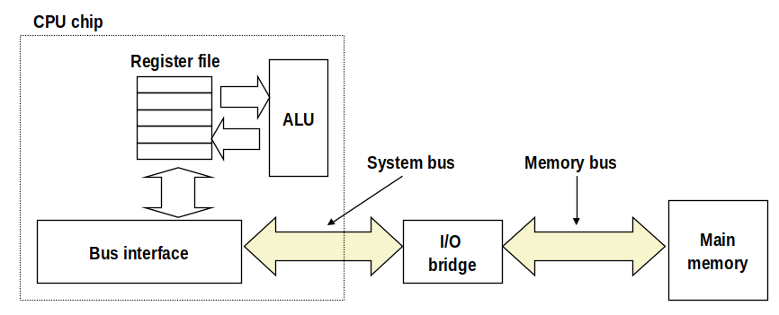

Memory Layout
!!!!!!!!where the hell is this pic from???????

Memory Hierarchy
- L0 Regs
- L1 L1 cache(SRAM)
- L2 L2 cache(SRAM)
- L3 L3 cache(SRAM)
- L4 Main memory(DRAM)
- L5 Local secondary storage(local disk)
- L6 Remote secondary storage(eg. web servers)

## Cache Memories
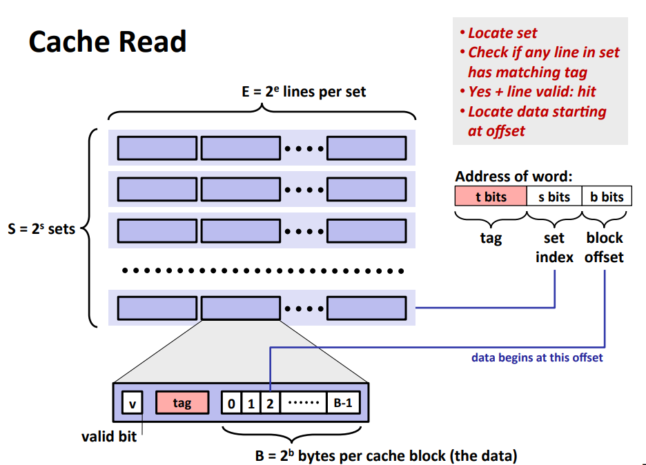


## ECF - Excetion Control Flow


### Excep&onal Control Flow	
Low level mechanisms
- Exceptions

Higher level mechanisms
- Process context switch
- Signals	
- Nonlocal jumps

### Exceptions
Asynchronous Excep&ons
- Interrupts (eg. Timer interrupt, I/O interrupt from external device)

Synchronous	Exceptions
- Traps	
    - Intentional	
    - Examples: system calls, breakpoint traps, special instructions
    - Returns control to “next” instruction	
- Faults
    - Unintentional but possibly recoverable
    - Examples: page faults(recoverable), protection faults(unrecoverable),	floating point exceptions	
    - Either re-executes faulting (“current”) instruction or aborts
- Aborts
    - Unintentional and unrecoverable
    - Examples: illegal instruction, parity error, machine check	
    - Aborts current program	

### Processes
Key abstractions:
1. Logical control flow
    - Each program seems to have exclusive use of the CPU
    - Provided by kernel mechanism called context switching
2. Private address space
    - Each program seems to	have exclusive use of main memory
    - Provided by kernel mechanism called virtual memory

Context Switching: Processes are managed by a shared chunk of memory-resident OS code called the kernel

### Process Control
Process States:
- Running
- Stopped
- Terminated

Terminating Processes:
```
void exit(int status)
```

Creating Processes:
```
int fork(void)
```
Returns 0 to the child process, child’s PID to parent process

- *wait*: Synchronizing with Children
- *waitpid*: Waiting for a Specific Process
- *execve*: Loading and Running Programs

## System Level I/O
File Types:
- Regular file
- Directory
- Socket
- Others
    - Named pipes(FIFOs)
    - Symbolic Links
    - Character and block devices

Opening Files:
- Opening a file informs the kernel that you are getting ready to access that file
- Returns a small identifying integer **file descriptor**
- Each process created by a Linux shell begins life with three open files associated with a termial: stgin, stdout and stderr


## Virtual Memory
From virtual memory address to physical address:
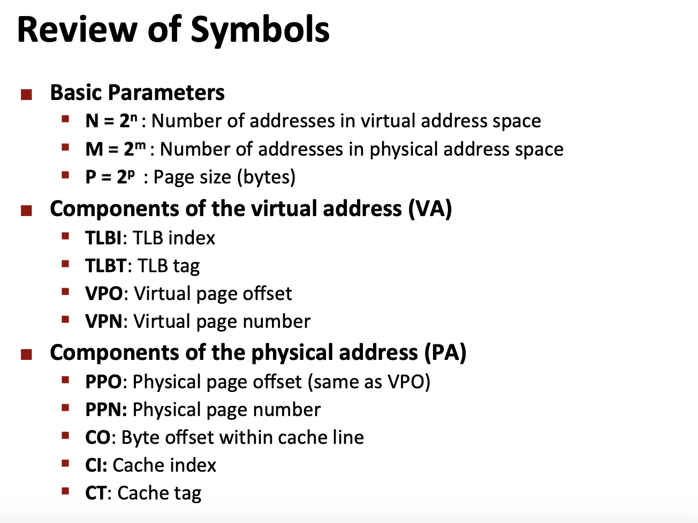
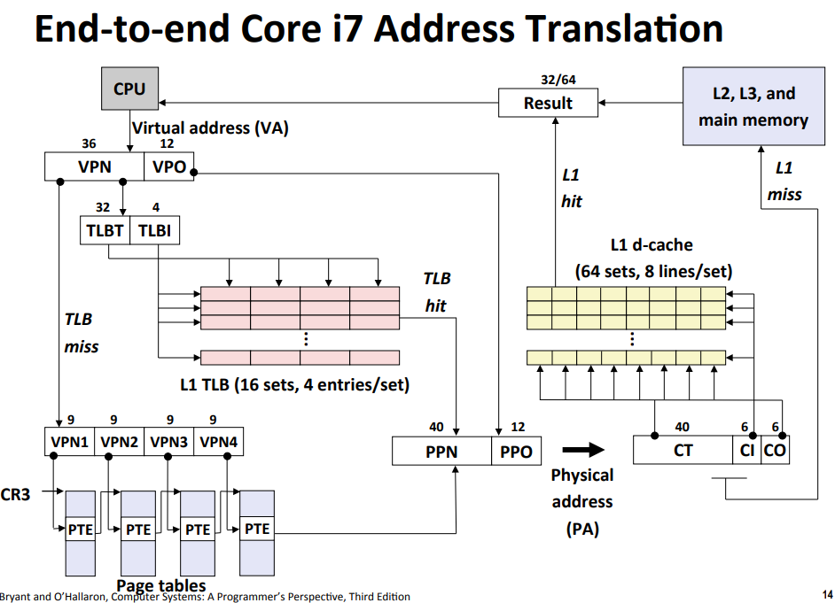


## Storage Allocation

### Basic Concepts
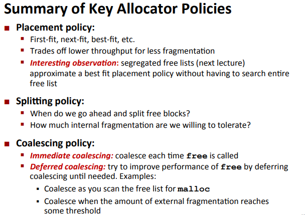

### Free Lists
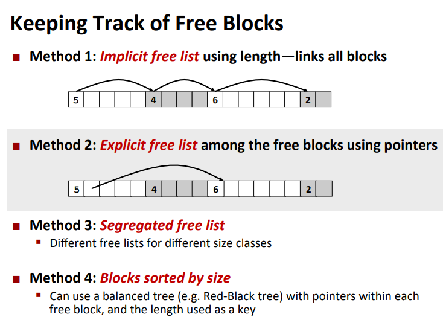

Implicit free lists
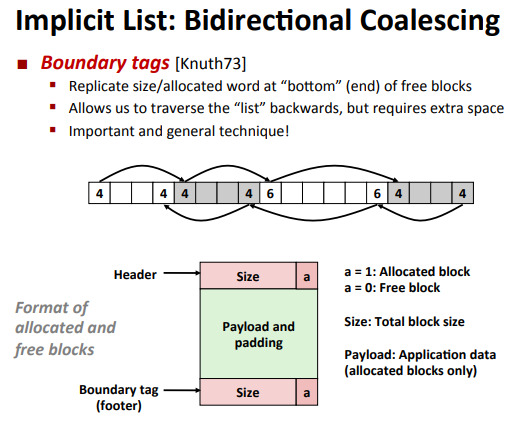
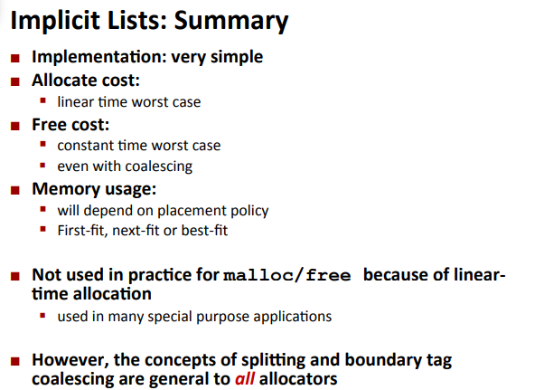

Explicit free lists: among the free blocks using pointers

Segregated free lists : Each size class of blocks has its own free list

### Garbage collection
Memory as a graph & Mark and Sweep Collecting

### Memory-related perils and piBalls
- Dereferencing bad pointers
- Reading uninitialized memory
- Overwriting memory
- Referencing nonexistent variables
- Freeing blocks multiple times	
- Referencing freed blocks
- Failing to free blocks


## Network Programming
Sockets
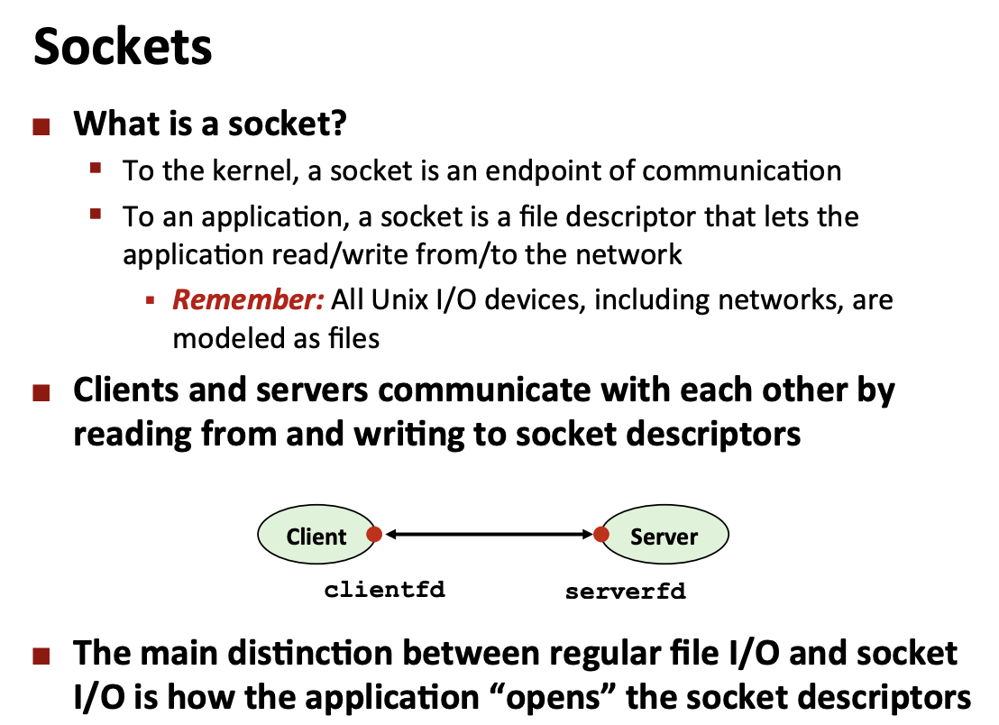

Sockets Interface:
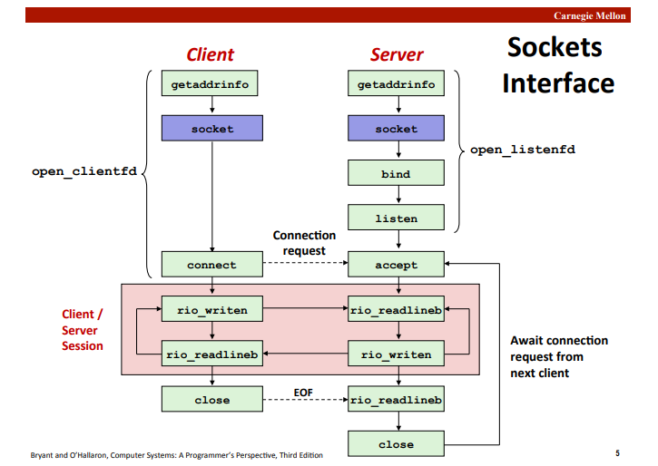

```
int getaddrinfo(const char *host,   /* Hostname or address */
    const char *service,            /* Port or service name */
    const struct addrinfo *hints,   /* Input parameters */
    struct addrinfo **result)       /* Output linked list */ 

int socket(int domain, int type, int protocol) 
int bind(int sockfd, SA *addr, socklen_t addrlen);
int listen(int sockfd, int backlog)
int accept(int listenfd, SA *addr, int *addrlen)
int connect(int clientfd, SA *addr, socklen_t addrlen)
```
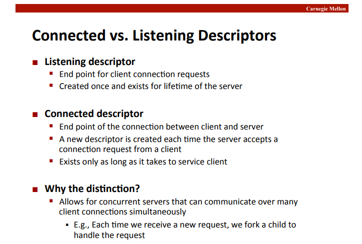
