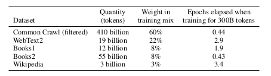

# 第五章 大模型的数据

## 5.1 大语言模型背后的数据

[Common Crawl](https://en.wikipedia.org/wiki/Common_Crawl)是一个非营利组织，它对网络进行爬取，并提供免费给公众的快照。由于其便利性，它已经成为许多模型如T5、GPT-3和Gopher的标准数据源。例如，Common Crawl在2021年4月的快照就有320TB的数据，这比谷歌的索引小了好几个数量级。

但网络数据在全球人口和不同人群中的代表性仍然不均衡。因此，理解和记录用于训练大型语言模型的数据集的组成是至关重要的。

### 5.1.1 WebText和OpenWebText数据集

WebText数据集被用于训练GPT-2模型。其目标是获取既多样化又高质量的数据集。以前的研究主要是在新闻、维基百科或小说等数据集上进行训练，而Common Crawl包含了大量的垃圾信息（如无意义文本和模板文本）。[Trinh和Le](https://arxiv.org/pdf/1806.02847.pdf)在2018年根据n-gram与目标任务的重叠性，选择了Common Crawl的一小部分。创建WebText的过程包括：抓取至少获得3个赞的所有外链，过滤掉维基百科以便在基于维基百科的基准测试中进行评估，最终得到了40GB的文本。

[OpenWebText数据集](https://skylion007.github.io/OpenWebTextCorpus/)在理念上复制了WebText的构建方法。OpenWebText从[Reddit提交的数据集](https://files.pushshift.io/reddit/submissions/)中提取所有URL，使用Facebook的[fastText](https://github.com/facebookresearch/fastText)过滤掉非英语内容，删除近乎重复的内容，最终得到了38GB的文本。

### 5.1.2 Colossal Clean Crawled Corpus（C4）

[C4语料库](https://www.tensorflow.org/datasets/catalog/c4)被用来训练T5模型。这个语料库从2019年4月的Common Crawl快照（1.4万亿个标记）开始，移除了“[bad words](https://github.com/LDNOOBW/List-of-Dirty-Naughty-Obscene-and-Otherwise-Bad-Words/blob/master/en)”，移除了代码（“{”），通过langdetect过滤掉了非英语文本，最终得到了806GB的文本（1560亿个标记）。

### 5.1.3 Benchmark的数据污染问题
一般而言，在机器学习中，保证训练数据和测试数据的分离（我们称之为数据卫生）相对容易。但对于大型语言模型，训练数据和基准数据都源自互联网，要事先保证它们的完全分离就显得有些困难。

### 5.1.4 GPT-3的数据集

GPT-3的数据集主要源自Common Crawl，而Common Crawl又类似于一个参考数据集——WebText。GPT-3下载了41个分片的Common Crawl数据（2016-2019年）。通过训练一个二元分类器来预测WebText与Common Crawl的区别，如果分类器认为文档更接近WebText，那么这个文档就有更大的概率被保留。在处理数据时，GPT-3采用了模糊去重的方法（检测13-gram重叠，如果在少于10个训练文档中出现，则移除窗口或文档），并从基准数据集中移除了数据。此外，GPT-3也扩大了数据来源的多样性（包括WebText2、Books1、Books2以及维基百科）。在训练过程中，Common Crawl被降采样，它在数据集中占82%，但只贡献了60%的数据。

然而，GPT-3也暗示了我们除了网络爬虫之外，也许还可以寻找其他更高质量的数据来源。EleutherAI（一个致力于构建开放语言模型的非营利组织）进一步推动了这个想法。他们发布了一种语言模型的数据集，名为The Pile，其核心理念是从较小的高质量数据源（如学术和专业资源）中获取数据。

### 5.1.5 The Pile数据集
[The Pile](https://arxiv.org/pdf/2101.00027.pdf)数据集包含了825GB的英文文本，由22个高质量数据集组成。当用这个数据集训练GPT-2Pile（1.5B参数）并与用GPT-3数据集训练的GPT-3（175B参数）进行比较时，研究者们发现，The Pile包含了大量GPT-3数据集未能很好覆盖的信息。他们还分析了贬损内容、性别/宗教偏见等问题，结果与以前的研究大致相同。

## 5.2 数据集文档
数据文档的主要目的有两个：一方面，它让数据集的创建者有机会反思他们的决策，以及在创建数据集过程中可能产生的潜在危害，比如社会偏见；另一方面，它让数据集的使用者了解何时可以使用数据集，何时不应使用数据集。

## 5.3 数据生态
目前为止，我们主要关注了现有大型语言模型数据集的分析以及文档记录，但实际上数据是一个广泛的概念，可以从许多其他角度进行研究。

在数据管理方面，我们在机器学习研究中通常认为数据集是固定的对象，收集起来之后，直接投入到训练算法中。然而在数据库领域，有一整个子领域正在思考数据是如何产生和使用的生态系统，这在工业领域特别相关。

在基础模型报告的数据部分中讨论了[一些问题](https://crfm.stanford.edu/assets/report.pdf#data)。[数据治理](https://en.wikipedia.org/wiki/Data_governance)主要关注一个组织如何创建数据、维护其质量和安全性。Hugging Face发起的[BigScience的数据治理工作组](https://www.youtube.com/watch?v=NL1_kMOkHm8)正在开发一个框架，以负责任地策划高质量的数据源，而不是无差别地爬取网页。

数据尊严是一个源自微软和RadicalxChange的概念，试图思考数据的本质。