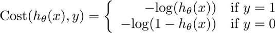
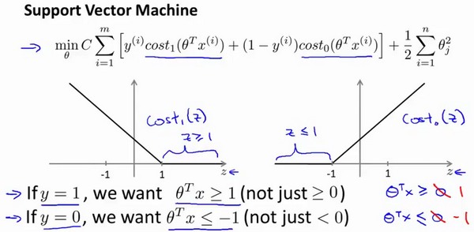

# 引言
- 回归 - 推测出这一系列连续值属性
- 机器学习分类
    - 监督学习
        - 回归问题
        - 分类问题
    - 无监督学习

# 单变量线性回归(Linear Regression with One Variable)
$h$  代表学习算法的解决方案或函数也称为假设（**hypothesis**） $h_\theta \left( x \right)=\theta_{0}+\theta_{1}x$

代价函数 $J \left( \theta_0, \theta_1 \right) = \frac{1}{2m}\sum\limits_{i=1}^m \left( h_{\theta}(x^{(i)})-y^{(i)} \right)^{2}$

梯度下降算法 ${\theta_{j}}:={\theta_{j}}-\alpha \frac{\partial }{\partial {\theta_{j}}}J\left(\theta \right)$

$\frac{\partial }{\partial {{\theta }_{j}}}J({{\theta }_{0}},{{\theta }_{1}})=\frac{\partial }{\partial {{\theta }_{j}}}\frac{1}{2m}{{\sum\limits_{i=1}^{m}{\left( {{h}_{\theta }}({{x}^{(i)}})-{{y}^{(i)}} \right)}}^{2}}$

$j=0$  时：$\frac{\partial }{\partial {{\theta }_{0}}}J({{\theta }_{0}},{{\theta }_{1}})=\frac{1}{m}{{\sum\limits_{i=1}^{m}{\left( {{h}_{\theta }}({{x}^{(i)}})-{{y}^{(i)}} \right)}}}$

$j=1$  时：$\frac{\partial }{\partial {{\theta }_{1}}}J({{\theta }_{0}},{{\theta }_{1}})=\frac{1}{m}\sum\limits_{i=1}^{m}{\left( \left( {{h}_{\theta }}({{x}^{(i)}})-{{y}^{(i)}} \right)\cdot {{x}^{(i)}} \right)}$

# 多变量线性回归(Linear Regression with Multiple Variables)

假设 $h_{\theta} \left( x \right)={\theta_{0}}{x_{0}}+{\theta_{1}}{x_{1}}+{\theta_{2}}{x_{2}}+...+{\theta_{n}}{x_{n}}$ 

其中$x_{0}=1$用于简化表达，$x=\left( {x_{0}},{x_{1}},{x_{2}},...,{x_{n}} \right)$ 是$n+1$维的向量。特征矩阵$X$的维度是 $m*(n+1)$，因此公式可以简化为：$h_{\theta} \left( x \right)={\theta^{T}}X$，其中上标$T$代表矩阵转置。

$J\left( {\theta_{0}},{\theta_{1}}...{\theta_{n}} \right)=\frac{1}{2m}\sum\limits_{i=1}^{m}{{{\left( h_{\theta} \left({x}^{\left( i \right)} \right)-{y}^{\left( i \right)} \right)}^{2}}}$

## 梯度下降法实践
1. 将所有特征的尺度都尽量缩放到-1到1之间
2. 梯度下降算法的每次迭代受到学习率的影响，如果学习率$a$过小，则达到收敛所需的迭代次数会非常高；如果学习率$a$过大，每次迭代可能不会减小代价函数，可能会越过局部最小值导致无法收敛

# 逻辑回归(Logistic Regression)
用于分类，算法本质：输出值永远在0～1之间。

逻辑回归模型的假设是： $h_\theta \left( x \right)=g\left(\theta^{T}X \right)$
其中：
$X$ 代表特征向量
$g$ 代表逻辑函数（**logistic function**)是一个常用的逻辑函数为**S**形函数（**Sigmoid function**），公式为： $g\left( z \right)=\frac{1}{1+{{e}^{-z}}}$

代价函数 $J\left( \theta  \right)=\frac{1}{m}\sum\limits_{i=1}^{m}{{Cost}\left( {h_\theta}\left( {x}^{\left( i \right)} \right),{y}^{\left( i \right)} \right)}$

其中

简化 $Cost\left( {h_\theta}\left( x \right),y \right)=-y\times log\left( {h_\theta}\left( x \right) \right)-(1-y)\times log\left( 1-{h_\theta}\left( x \right) \right)$

$\theta_j := \theta_j - \alpha \frac{1}{m}\sum\limits_{i=1}^{m}{{\left( {h_\theta}\left( \mathop{x}^{\left( i \right)} \right)-\mathop{y}^{\left( i \right)} \right)}}\mathop{x}_{j}^{(i)}$ 
**(simultaneously update all** )

# 正则化(Regularization)
## 过拟合处理
1. 丢弃一些不能帮助我们正确预测的特征。可以是手工选择保留哪些特征，或者使用一些模型选择的算法来帮忙（例如**PCA**）
2. 正则化。 保留所有的特征，但是减少参数的大小

## 代价函数
$J\left( \theta  \right)=\frac{1}{2m}[\sum\limits_{i=1}^{m}{{{({h_\theta}({{x}^{(i)}})-{{y}^{(i)}})}^{2}}+\lambda \sum\limits_{j=1}^{n}{\theta_{j}^{2}}]}$

其中$\lambda $又称为正则化参数（**Regularization Parameter**）。 注：根据惯例，我们不对${\theta_{0}}$ 进行惩罚。

## 正则化线性回归
${\theta_j}:={\theta_j}(1-a\frac{\lambda }{m})-a\frac{1}{m}\sum\limits_{i=1}^{m}{({h_\theta}({{x}^{(i)}})-{{y}^{(i)}})x_{j}^{\left( i \right)}}​$ 

可以看出，正则化线性回归的梯度下降算法的变化在于，每次都在原有算法更新规则的基础上令$\theta $值减少了一个额外的值。

# 神经网络
## 模型表示

$a_{i}^{\left( j \right)}$ 代表第$j$ 层的第 $i$ 个激活单元。${{\theta }^{\left( j \right)}}$代表从第 $j$ 层映射到第$ j+1$ 层时的权重的矩阵。

对于上图所示的模型，激活单元和输出分别表达为：

$a_{1}^{(2)}=g(\Theta _{10}^{(1)}{{x}_{0}}+\Theta _{11}^{(1)}{{x}_{1}}+\Theta _{12}^{(1)}{{x}_{2}}+\Theta _{13}^{(1)}{{x}_{3}})$

$a_{2}^{(2)}=g(\Theta _{20}^{(1)}{{x}_{0}}+\Theta _{21}^{(1)}{{x}_{1}}+\Theta _{22}^{(1)}{{x}_{2}}+\Theta _{23}^{(1)}{{x}_{3}})$

$a_{3}^{(2)}=g(\Theta _{30}^{(1)}{{x}_{0}}+\Theta _{31}^{(1)}{{x}_{1}}+\Theta _{32}^{(1)}{{x}_{2}}+\Theta _{33}^{(1)}{{x}_{3}})$

${{h}_{\Theta }}(x)=g(\Theta _{10}^{(2)}a_{0}^{(2)}+\Theta _{11}^{(2)}a_{1}^{(2)}+\Theta _{12}^{(2)}a_{2}^{(2)}+\Theta _{13}^{(2)}a_{3}^{(2)})$

每一个$a$都是由上一层所有的$x$和每一个$x$所对应的决定的，我们把这样从左到右的算法称为前向传播算法( **FORWARD PROPAGATION** )）

把$x$, $\theta$, $a$ 分别用矩阵表示，可以得到$\theta \cdot X=a$

## 代价函数
$$h_\theta\left(x\right)\in \mathbb{R}^{K}$$

$\newcommand{\subk}[1]{ #1_k }$

$$J(\Theta) = -\frac{1}{m} \left[ \sum\limits_{i=1}^{m} \sum\limits_{k=1}^{k} {y_k}^{(i)} \log \subk{(h_\Theta(x^{(i)}))} + \left( 1 - y_k^{(i)} \right) \log \left( 1- \subk{\left( h_\Theta \left( x^{(i)} \right) \right)} \right) \right] + \frac{\lambda}{2m} \sum\limits_{l=1}^{L-1} \sum\limits_{i=1}^{s_l} \sum\limits_{j=1}^{s_{l+1}} \left( \Theta_{ji}^{(l)} \right)^2$$

## 反向传播
代价函数的偏导数 $D_{ij}^{(l)}=\frac{\partial}{\partial\Theta^{(l)}_{ij}}J\left(\Theta\right)$

$ D_{ij}^{(l)} :=\frac{1}{m}\Delta_{ij}^{(l)}+\lambda\Theta_{ij}^{(l)}$ ${if}\; j \neq  0$

$ D_{ij}^{(l)} :=\frac{1}{m}\Delta_{ij}^{(l)}$ ${if}\; j = 0$

其中：

$\Delta_{ij}^{(l)}=\Delta_{ij}^{(l)}+a_{j}^{(l)}\delta_{i}^{l+1}$

$\delta^{(l)}=\left({\Theta^{(l)}}\right)^{T}\delta^{(l+1)}\ast g'\left(z^{(l)}\right)$ 点乘

## 应用建议

### 随机初始化
参数矩阵的初始化需要随机，不可全部初始化为0

### 训练技巧
1. 使用交叉验证集
2. 偏差&方差
    - 训练集误差和交叉验证集误差近似时：偏差/欠拟合
    - 交叉验证集误差远大于训练集误差时：方差/过拟合
3. 正则化与偏差&方差
    - 当 $\lambda$ 较小时，训练集误差较小（过拟合）而交叉验证集误差较大
    - 随着 $\lambda$ 的增加，训练集误差不断增加（欠拟合），而交叉验证集误差则是先减小后增加
4. 观察学习曲线
    - 在高偏差/欠拟合的情况下，增加数据到训练集不一定能有帮助
    
    - 在高方差/过拟合的情况下，增加更多数据到训练集可能可以提高算法效果
    
5. 不同情况下的选择
    - 获得更多的训练样本——解决高方差
    - 尝试减少特征的数量——解决高方差
    - 尝试获得更多的特征——解决高偏差
    - 尝试增加多项式特征——解决高偏差
    - 尝试减少正则化程度λ——解决高偏差
    - 尝试增加正则化程度λ——解决高方差

### 误差分析
将算法预测的结果分成四种情况：
	
1. **正确肯定**（**True Positive,TP**）：预测为真，实际为真
2. **正确否定**（**True Negative,TN**）：预测为假，实际为假
3. **错误肯定**（**False Positive,FP**）：预测为真，实际为假
4. **错误否定**（**False Negative,FN**）：预测为假，实际为真

|            |              | **预测值**    |             |
| ---------- | ------------ | ------------ | ----------- |
|            |              | **Positive** | **Negtive** |
| **实际值**  | **Positive** | **TP**       | **FN**      |
|            | **Negtive**  | **FP**       | **TN**      |

精确率Precision=**TP/(TP+FP)**

召回率Recall=**TP/(TP+FN)**

设置不同的结果阈值，两个度量值会变化，且精确率和召回率之间负相关。可以选使**F1**最高的作为阈值：

${{F}_{1}}Score:2\frac{PR}{P+R}$

# 支持向量机(Support Vector Machines)

SVM的优化目标函数

$C=1/\lambda$（类比逻辑回归），因此：
- $C$ 较大时，相当于 $\lambda$ 较小，可能会导致过拟合，高方差
- $C$ 较小时，相当于$\lambda$较大，可能会导致低拟合，高偏差

SVM本质上还是“浅度学习”，不带核函数的SVM只能线性分类。带核函数也本质上是把线性不可分问题映射到一个可分问题上，本质还是线性分类。然而这个映射函数的构造并不容易，多数问题即使映射到高维它还是线性不可分。SVM本质上只有一层，所以是“浅度学习”。

# 无监督学习

## 聚类(Clustering) - K-Means

$μ^1$,$μ^2$,...,$μ^k$ 来表示聚类中心，用$c^{(1)}$,$c^{(2)}$,...,$c^{(m)}$来存储与第$i$个实例数据最近的聚类中心的索引，期代价函数（又称**畸变函数** **Distortion function**）为：

$$J(c^{(1)},...,c^{(m)},μ_1,...,μ_K)=\dfrac {1}{m}\sum^{m}_{i=1}\left\| X^{\left( i\right) }-\mu_{c^{(i)}}\right\| ^{2}$$

## 降维(Dimensionality Reduction)

### 降维动机
- 数据压缩：将数据从二维降至一维、将数据从三维降至二维...将1000维的特征降至100维
- 数据可视化：降维的算法只负责减少维数，新产生的特征的意义就必须由我们自己去发现了

### 降维算法
#### 主成分分析(**PCA**)
主成分分析问题的描述：是要将$n$维数据降至$k$维，目标是找到向量$u^{(1)}$,$u^{(2)}$,...,$u^{(k)}$使得总的投射误差最小。

主成分的数量：在平均均方误差与训练集方差的比例尽可能小的情况下选择尽可能小的$k$值

错误的主要成分分析情况：将其用于减少过拟合（减少了特征的数量），这样做非常不好，不如尝试正则化处理，原因在于主要成分分析只是近似地丢弃掉一些特征，它并不考虑任何与结果变量有关的信息，因此可能会丢失非常重要的特征。而正则化处理时会考虑到结果变量，不会丢掉重要的数据。另一个常见的错误是，默认地将主要成分分析作为学习过程中的一部分，虽然很多时候有效果，但最好还是从所有原始特征开始，只在有必要的时候（算法运行太慢或者占用太多内存）考虑采用主要成分分析。

## 异常检测(Anomaly Detection)

异常检测算法：对于给定的数据集 $x^{(1)},x^{(2)},...,x^{(m)}$，我们要针对每一个特征计算 $\mu$ 和 $\sigma^2$ 的估计值。

$\mu_j=\frac{1}{m}\sum\limits_{i=1}^{m}x_j^{(i)}$

$\sigma_j^2=\frac{1}{m}\sum\limits_{i=1}^m(x_j^{(i)}-\mu_j)^2$

一旦我们获得了平均值和方差的估计值，给定新的一个训练实例，根据模型计算 $p(x)$：

$p(x)=\prod\limits_{j=1}^np(x_j;\mu_j,\sigma_j^2)=\prod\limits_{j=1}^1\frac{1}{\sqrt{2\pi}\sigma_j}exp(-\frac{(x_j-\mu_j)^2}{2\sigma_j^2})$

将$p(x) = \varepsilon$作为我们的判定边界，当$p(x) > \varepsilon$时预测数据为正常数据，否则为异常。

# 大规模机器学习(Large Scale Machine Learning)

## 随机梯度下降法(Stochastic Gradient Descent)
随机梯度下降算法在每一次计算之后便更新参数 ${{\theta }}$ ，而不需要首先将所有的训练集求和

## 小批量梯度下降(Mini-Batch Gradient Descent)
小批量梯度下降算法是介于批量梯度下降算法和随机梯度下降算法之间的算法，每计算常数$b$次训练实例，便更新一次参数  ${{\theta }}$ 。

## 随机梯度下降收敛(Stochastic Gradient Descent Convergence)
随机梯度下降算法的调试，以及学习率 $α$ 的选取。

## 在线学习(Online Learning)
在线学习的算法与随机梯度下降算法有些类似，我们对单一的实例进行学习，而非对一个提前定义的训练集进行循环。
 Repeat forever (as long as the website is running) {
  Get $\left(x,y\right)$ corresponding to the current user 
​        $\theta:={\theta}_{j}-\alpha\left( {h}_{\theta}\left({x}\right)-{y} \right){{x}_{j}}$
​       (**for** $j=0:n$) 
    }